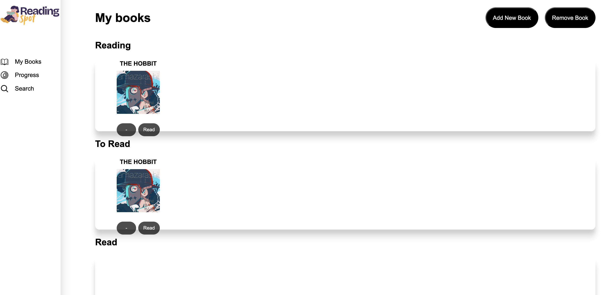
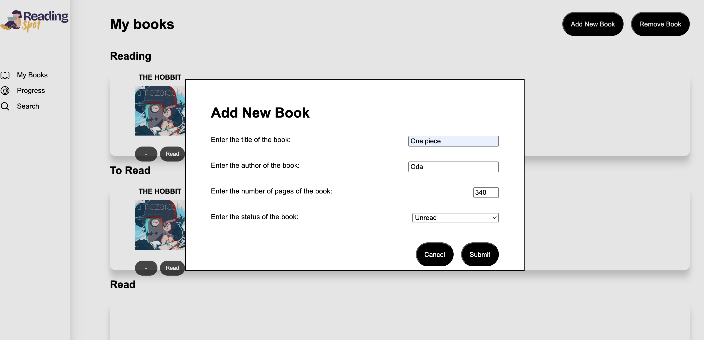

#  Library Manager

> Digital library application for managing your personal book collection

[Live Demo](https://katelynyew.github.io/library-app) | [View Code](https://github.com/katelynyew/library-app)



---

##  Table of Contents
- [Overview](#overview)
- [Features](#features)
- [Screenshots](#screenshots)
- [Tech Stack](#tech-stack)
- [Getting Started](#getting-started)
- [What I Learned](#what-i-learned)

---

##  Overview

A sleek library management system that helps you track your reading journey. Add books, mark them as read, and organize your personal collection with an intuitive card-based interface.

**Built using Object-Oriented Programming principles** with constructors and prototypes.

---

##  Features

✅ **Add Books** - Quick form to add title, author, pages, and read status  
✅ **Remove Books** - Delete books from your collection  
✅ **Toggle Read Status** - Mark books as read/unread with one click  
✅ **Form Validation** - Ensures data integrity  
✅ **Card Layout** - Beautiful, responsive grid display  
✅ **Data Persistence** - Books saved to local storage  

---

##  Screenshots

### Library Collection


### Add Book Form



---

##  Tech Stack

**Frontend:**
- Vanilla JavaScript (OOP)
- HTML5
- CSS3 (Grid/Flexbox)

**Concepts:**
- Object Constructors
- Prototypes
- Local Storage API

---

##  Code Structure
```javascript
// Book Constructor
function Book(title, author, pages, read) {
  this.title = title;
  this.author = author;
  this.pages = pages;
  this.read = read;
}

// Prototype Method
Book.prototype.toggleRead = function() {
  this.read = !this.read;
  updateLocalStorage();
  displayBooks();
}

// Library Array
let myLibrary = [];
```

---

##  Getting Started
```bash
# Clone repository
git clone https://github.com/katelynyew/library-app.git

# Navigate to directory
cd library-app

# Open in browser
open index.html
```

---

##  What I Learned

**Technical Skills:**
- Object-oriented programming in JavaScript
- Constructor functions and prototypes
- Form validation and user input handling
- CSS Grid for responsive card layouts
- Local Storage for data persistence

**OOP Concepts Applied:**
- Encapsulation of book data
- Prototype methods for shared functionality
- Object instantiation with `new` keyword
- Managing collections of objects

---

##  Future Enhancements

- [ ] Book categories/genres
- [ ] Search and filter functionality
- [ ] Book cover images via Google Books API
- [ ] Reading progress tracker
- [ ] Export library to CSV/JSON
- [ ] Reading statistics dashboard
- [ ] Book recommendations

---

##  License

MIT License

---

<p align="center">Made with ❤️ by Katelyn Yew</p>
<p align="center">
  <a href="https://github.com/katelynyew">GitHub</a> •
  <a href="https://linkedin.com/in/katelynyew">LinkedIn</a>
</p>